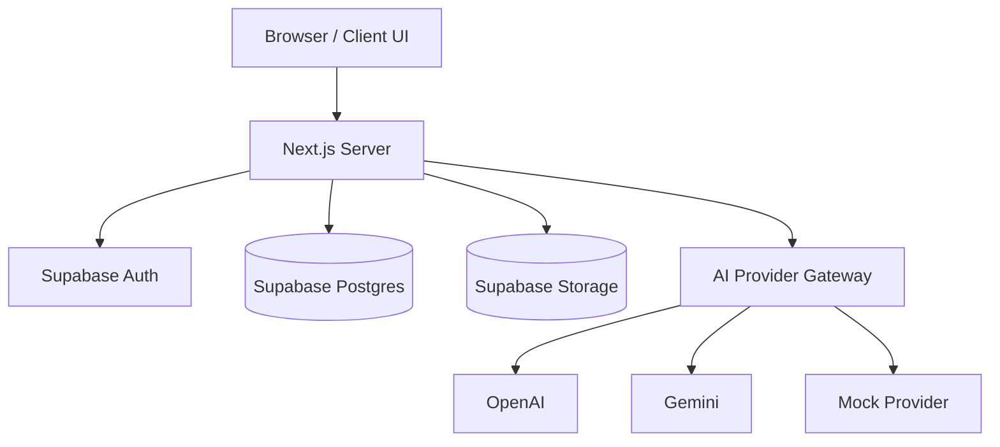

# Architecture Overview

Ruletrade-AI is built around user-owned investment rule data.

## Main components

## Core principle

The browser is not trusted.

All sensitive operations happen server-side.
