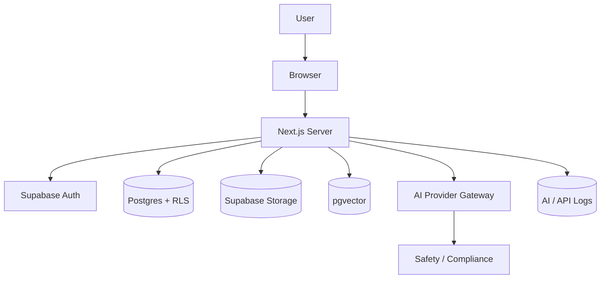

# Architecture Diagram

```mermaid
graph TD
  User[User]
  Browser[Browser]
  Server[Next.js Server]
  Auth[Supabase Auth]
  DB[(Postgres + RLS)]
  Storage[(Supabase Storage)]
  Vector[(pgvector)]
  AI[AI Provider Gateway]
  Safety[Safety / Compliance]
  Logs[(AI / API Logs)]

  User --> Browser
  Browser --> Server
  Server --> Auth
  Server --> DB
  Server --> Storage
  Server --> Vector
  Server --> AI
  AI --> Safety
  Server --> Logs
```
