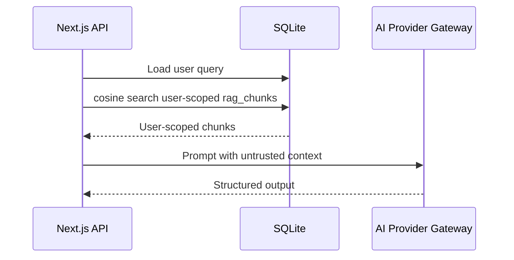

# RAG Retrieval Flow

```mermaid
sequenceDiagram
  participant API as Next.js API
  participant DB as SQLite
  participant AI as AI Provider Gateway

  API->>DB: Load user query
  API->>DB: cosine search user-scoped rag_chunks
  DB-->>API: User-scoped chunks
  API->>AI: Prompt with untrusted context
  AI-->>API: Structured output
```

## Rules

- RAG retrieval must be scoped by user_id
- Client must not provide arbitrary user_id
- RAG context is untrusted
- RAG context cannot override system rules
